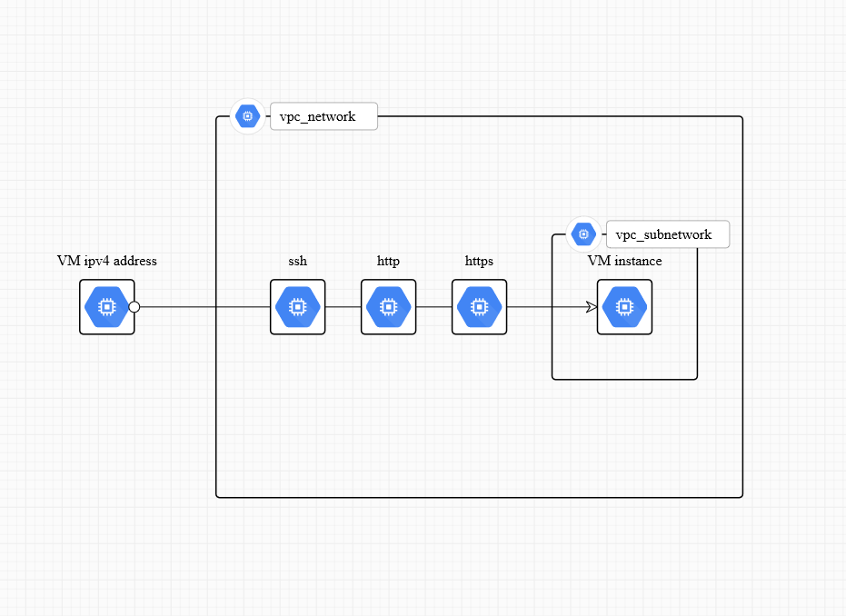

# landing-deploy

An infrastructure deployment with Terraform, Ansible and self-deployed Kubernetes on Google Cloud Platform following GitOps practices.

## Example

## Requirements

- `terraform`[^1],
- `ansible`[^2],
- `gcloud`[^3] and `gke-gcloud-auth-plugin`[^3],
- `kubectl`[^4] (optional).

## Usage

- Configure `/provision/gcp-instance/terraform.tfvars.sample` and rename file to `/provision/gcp-instance/terraform.tfvars`.
  - Create a service account key with `roles/compute.admin`[^5] permission in GCP,
  - Download key in json format and store it in `/provision/credentials/credentials.json`[^6].
  - Set project ID (from json credentials), project name and repository credentials.

- Configure `/provision/config.yaml.sample` and rename file to `/provision/config.yaml` (default values work for public repositories).

- Run `terraform`:
  - `cd provision/gcp-instance/`,
  - `terraform init` to initialize current directory with Terraform,
  - `terraform plan` to check resource creation in a non-destructive way (dry-run),
  - `terraform apply` to create cloud resources (require validation).

## Repository

Repository is structured into three parts: a `/provision` directory for cloud-infrastructure provisioning with Terraform, a `/config` directory for configuration management with Ansible and `/deploy` directory for application configuration with Kubernetes.

Cloud infrastructure is provisioned with Terraform on Google Cloud Platform. Virtual machine image is based on Rocky Linux 9 optimized for GCP[^7]. This virtual machine will be a kubernetes control plane node used as a bootstrap node for etcd distributed storage, so configuration is using a `google_compute_instance` rather than a `google_compute_region_instance_group_manager`. Subsequent server and agent nodes could use a regional managed instance groups (MIG)[^8] to benefit from autoscaling and self-healing abilities. However MIG are more complex to setup because they require a cloud load balancer to work properly. GCP load balancers are based on `google_compute_backend_service`, `google_compute_url_map`, `google_compute_target_<protocol>_proxy` and `google_compute_global_forwarding_rule` resources.

Provisioned virtual machine is then configured with ansible in pull mode. While ansible default push mode is very straightforward for self-managed on-premise resources, this is very inefficient to configure virtual machine replicas managed by a cloud provider auto-scaler. Thus ansible can be used in pull mode with `ansible-pull` command. Virtual machines run a script provided through metadata to install ansible dependencies, run ansible-pull command to pull a remote repository (actually this repository) which contains a playbook and then execute it locally. This playbook executes roles to install fluxcd cli binary, k3s binary, configure and start k3s service, run flux bootstrap routine and provision kubernetes secrets. K3s configuration is based on node mode, i.e. primary, server or agent node.

Flux kustomize and helm controllers are in charge to reconcile flux kustomize and helm kubernetes custom resources. Flux bootstrap reconciles a kustomization in `/deploy/clusters/production` which itself reconciles `/deploy/infrastructure/controllers`, `/deploy/infrastructure/configs` and `/deploy/apps/production`. This configuration embraces GitOps practices, permitting to use continuous deployment and to apply rolling upgrade automatically. Infrastructure configuration is common among clusters and it lives on this repository. Application configurations on the other hand come from other public or private git repositories or helm charts. This repository pattern is flexible to follow operational requirements and ensure separation of concerns.

### `/provision` directory

- Contains terraform HCL resources to provision cloud infrastructure from GCP provider.
  - `gcp-instance/main.tf` declares HCL resources,
  - `gcp-instance/variables.tf` declares and defines default values for variables used in resources,
  - `gcp-instance/terraform.tfvars.sample` overrides variable values.

### `/config` directory

- Follows ansible playbook best practices.
  - `primary.yaml`, `server.yaml` and `agent.yaml` are playbooks,
  - `roles/*` contains reusable tasks,
  - `group_vars/all.yaml` contains important variables.

### `/deploy` directory

- Follows flux repository guideline.
  - `clusters/production` and `clusters/staging` are cluster entrypoints,
  - `infrastructure/controllers` to deploy cluster controllers such as cert-manager or sealed-secrets,
  - `infrastructure/configs` to deploy cluster configurations such as cluster-issuers or network-policies,
  - `apps/production` and `apps/staging` are application overlays for specific environments,
  - `apps/base` contains application configuration.

## Miscellaneous

### Scale k3s from single-node cluster to multi-node cluster

Single-node k3s cluster are production ready but load balancing should be configured properly at each system level to ensure good quality of service for multi-nodes cluster (thus achieving true high-availability).

K3s is shipped with an internal load balancer implementation. It is perfectly suitable for single-node usage but it should be avoided for multi-nodes cluster. Default load balancer must be disable with `--disable=servicelb` server argument to install replacement solutions. Production configuration highly depends on execution environment. On-premise, a metal-bare load balancer should be deployed and configure to load balanced charges in layer 3 mode (or BGP mode). [MetalLB](https://metallb.universe.tf/concepts/bgp/) and [OpenELB](https://openelb.io/docs/) are suitable solutions for this purpose. On cloud-hosted environment, default cloud controller manager must be disabled with `--disable-cloud-controller` to install dedicated cloud controller. A cloud kubernetes distribution as [GKE](https://cloud.google.com/kubernetes-engine/docs?hl=fr) is a lot simpler for this purpose.

### Manage secrets on Kubernetes

Secrets on a Kubernetes cluster should be managed either in a GitOps manner with encrypted secrets or with an external secret manager. Encrypted solutions are based on [sealed-secrets](https://github.com/bitnami-labs/sealed-secrets#readme) operator or client-side [SOPS](https://github.com/getsops/sops) cli. Sealed-secrets encryption is based on a certificate key-pair while SOPS relies on a cryptographic key from an external secret manager. External secret managers are cloud-hosted or self-hosted solutions such as [Google Secret Manager](https://cloud.google.com/secret-manager) or [HashiCorp Vault](https://developer.hashicorp.com/vault/docs). [External-secrets](https://external-secrets.io/latest/) operator is required to synchronize those secrets into Kubernetes cluster. Operator itself requires credentials to access secret manager. A rolling upgrade should be scheduled when a secret rotation happens, either manually or with a custom controller such as stakater/reloader. FluxCD supports rolling upgrade natively through SOPS integration with kustomize-controller.

Sealed-secrets and SOPS aim to introduce GitOps practices to secret themselves and thus storing them directly in a git repository while external-secrets aims to integrate secrets from an external source. How to choose a solution or how to mix them depending on requirements ?

Using encrypted secrets in repositories allows to embrace Git workflows for secret management. Developers encrypts secrets client-side and push them to a repository. Then it can be validated by a cluster administrator and finally be pushed to a production branch. Rotation is ensured through git workflows. No need for a dedicated secret manager anymore. Yet it requires continuous integration automation to avoid secret sprawl. On the other hand, a secret manager represents a configuration and management overhead but it allows to centralize secrets in one place and thus avoid sprawl.

Sealed-secrets is a lightweight solution useful to solve "chicken or the egg" problems. But it lacks rotating capabilities so it is not suitable to handle multiple secrets without customization. SOPS solution is very useful for simple cases especially in utilization with FluxCD. Integration with kustomize secretGenerator makes it very simple to use. External secrets should be used with a custom controller to roll workloads upgrade on secret changes. Complex requirements can be satisfied by a combination of external-secrets with sealed-secrets: encrypting multiple secret managers credentials with sealed-secrets for external-secrets usage, ensuring a GitOps approach to use github/gitlab workflows for externally managed secrets.

## Toolchain

### Cloud Provider: Google Cloud Platform

Google Cloud is a cloud provider which delivers cloud computing resources on demand. This is an infrastructure as a service (IAAS) and a platform as a service (PAAS) provider. It offers a wide range of services from virtual machines, cloud storages, cloud functions to cloud-hosted databases such as BigTable or PostgreSQL. It delivers services through an API and a rich web interface, the console. Cloud providers usually provide a fine-grained identity and access management (IAM) system to control who is able to deploy or monitor resources.

- Documentation: [Google Cloud documentation](https://cloud.google.com/docs)
- Documentation: [Compute Engine documentation](https://cloud.google.com/compute/docs)
- Documentation: [Cloud Storage documentation](https://cloud.google.com/storage/docs)
- Documentation: [Cloud Functions documentation](https://cloud.google.com/functions/docs)
- Console: [Google Cloud console](https://console.cloud.google.com/welcome)

### Application Orchestration: Kubernetes

Kubernetes is the operating system for running distributed architecture. It allows to decouple compute resources from running application thanks to clustering and containerization. It is a stateful orchestrator which watches an observed state and stores a desired state. When a node is unhealthy or a deployment replica count changes, Kubernetes control-plane is trigger and it tries to reconcile cluster status. Applications are defined with Kubernetes workloads such as deployments, statefulsets or daemonsets. Each one serves a specific purpose: deployments run stateless applications, statefulsets run stateful applications which require persistent storage and daemonsets run an application on each node of a cluster. One or more containers are wrapped in a basic unit called a pod. Kubernetes also exposes resources to handle network services and persistent volume storage.

- Documentation: [Kubernetes documentation](https://kubernetes.io/docs/home/)
- Documentation: [Kubernetes workloads](https://kubernetes.io/docs/concepts/workloads/)
- Documentation: [Kubernetes network](https://kubernetes.io/docs/concepts/services-networking/)
- Documentation: [Kubernetes storage](https://kubernetes.io/docs/concepts/storage/)
- Documentation: [Kubernetes service accounts](https://kubernetes.io/docs/concepts/security/service-accounts/)

---

### Infrastructure-as-Code: Terraform

Terraform is an Infrastructure-as-Code (IaC) tool developed by HashiCorp. It allows to manage cloud resources in a declarative and stateful fashion. For this purpose, it provides a strongly typed configuration language named HCL (for HashiCorp Configuration Language). Terraform exposes providers to interact with cloud API. It currently supports most of the entreprise-grade cloud providers. Terraform handles a "state" to describe resource status thus providing reconciliation capabilities when operators perform configuration modification. This state should be stored in a terraform backend for production workloads.

- Documentation: [Terraform documentation](https://developer.hashicorp.com/terraform/docs)
- Documentation: [Terraform backend](https://developer.hashicorp.com/terraform/language/settings/backends/configuration)
- Provider registry: [Terraform providers](https://registry.terraform.io/browse/providers)
- Provider registry: [Google Cloud Platform provider](https://registry.terraform.io/providers/hashicorp/google/latest/docs)

### Configuration Management: Ansible

Ansible is a push configuration management tool suite written in Python and maintained by RedHat. Its goal is to simplify upgrade and deploy process by providing way to write idempotent scripts. It is widely used to manage configuration either on physical machines or virtual machines. Configuration is based on playbooks which contain task units. A playbook runs each of its task sequentially and provides rich output for task status (changed, ok, failed, skipped, etc..). Tasks can be grouped in a reusable unit called a role. Ansible is a server-less configuration management tool. It only requires a ssh server on remote machines to perform configuration. Ansible also works in pull mode with a GitOps approach, fetching configuration from a remote repository and executing it locally.

- Documentation: [Ansible documentation](https://docs.ansible.com/ansible/latest/index.html)
- Documentation [Ansible best practices](https://docs.ansible.com/ansible/2.8/user_guide/playbooks_best_practices.html)
- Documentation: [`ansible-playbook` documentation](https://docs.ansible.com/ansible/latest/cli/ansible-playbook.html)
- Documentation: [`ansible-pull` documentation](https://docs.ansible.com/ansible/latest/cli/ansible-pull.html)
- Galaxy registry: [Galaxy search](https://galaxy.ansible.com/search?deprecated=false&keywords=&order_by=-relevance)

### Kubernetes Distribution: K3s

K3s is a lightweight kubernetes distribution from Rancher Labs (Kubernetes itself is only a specification). K3s is designed to run on IoT and edge devices thus it is very flexible and it can adapt to a vast range of scenarios. It is packaged to be ready to use out-of-the-box with add ons components like a core-dns server, a local path provisioner and a traefik reverse proxy. K3s powers single-node cluster, high-available multi-node cluster with schedulable or not schedulable control-plane nodes. Nevertheless multi-node cluster requires further configuration to run in production environment.

- Documentation: [K3s documentation](https://docs.k3s.io/)

### Continuous Deployment: FluxCD

FluxCD is a Kubernetes GitOps tool which ensures continuous deployment of applications. It installs custom resource definitions and control-plane components to watch custom resources such as GitRepository, HelmRepository, HelmRelease, HelmChart, Kustomize resources. Flux control-plane components then deploy application based on repository changes. It is suitable for multi cluster deployment from a control plane cluster. Flux also makes available an image update automation controller which watches container registry to automatically update image tag in kubernetes deployment or custom resources (like an openshift deployment config). A receiver could be setup to push notification from a git repository to trigger reconciliation rather than pulling repository at regular interval.

- Documentation: [FluxCD documentation](https://fluxcd.io/flux/concepts/)

## Roadmap

- Add managed instance group (MIG) for server nodes and agent nodes.
- Interactive CLI to configure repository (Terraform and Ansible configuration files).

## Author

[@gmarcha](https://github.com/gmarcha)

## License

[^1]: [install terraform](https://developer.hashicorp.com/terraform/downloads) cli.
[^2]: [install ansible](https://docs.ansible.com/ansible/latest/installation_guide/installation_distros.html) suite.
[^3]: [install gcloud](https://cloud.google.com/sdk/docs/install) cli and [install gke-gcloud-auth-plugin](https://cloud.google.com/sdk/docs/install#rpm).
[^4]: [install kubectl](https://kubernetes.io/docs/tasks/tools/install-kubectl-linux/) cli.
[^5]: see Compute Engine [documentation](https://cloud.google.com/compute/docs/access/iam) for roles (follow least privilege principle in production environment).
[^6]: see Terraform [documentation](https://developer.hashicorp.com/terraform/tutorials/gcp-get-started/google-cloud-platform-build#set-up-gcp) and GCP [documentation](https://cloud.google.com/iam/docs/keys-create-delete).
[^7]: see blog [article](https://cloud.google.com/blog/products/application-modernization/introducing-rocky-linux-optimized-for-google-cloud).
[^8]: see Google Cloud [documentation](https://cloud.google.com/compute/docs/instance-groups/creating-groups-of-managed-instances).
